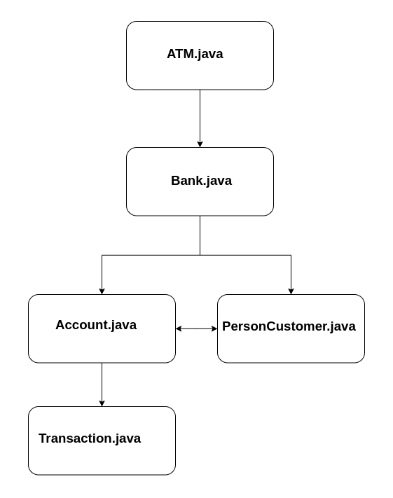
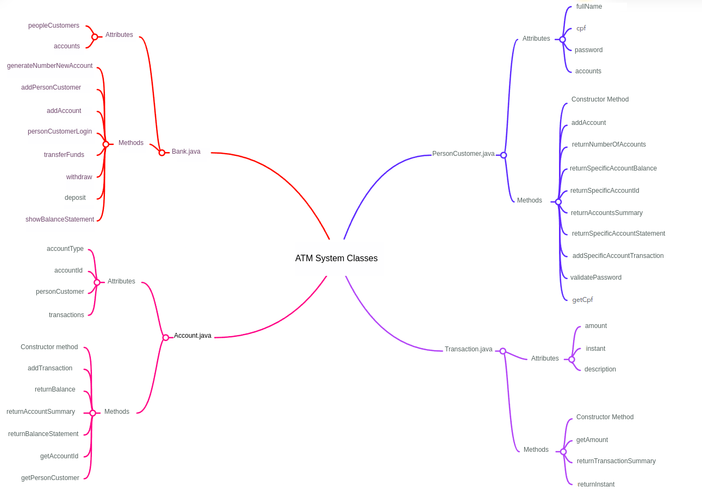

# Challenge requirements

# ATM Challange 💰

The day-to-day life of a developer is full of demands and here will be no different! It's your turn to develop an ATM system! 💰😮 But calm down... before starting, see all the criteria that the system must have to allow the client to:

- To sign in to the system;

- To visualize and manipulate their  bank account information;

- To have access to all transaction made.

⚠️**Remember:** ⚠️the company you represent follows the Test Driven Development (TDD) practice to develop their systems. Check the image below to remember how it works: 👇


First, we will develop tests, and then the classes of this ATM's system, ok?

The mandatory tests are described below (note that you are free to add more tests), following are the classes the system must have:


## 1. Tests

- `BankTest`: this class contains all the tests related to the methods of our ATM system's `Bank` class.
    - Test Methods:
        - `generateNumberNewAccountTest`: verifies if the method `generateNumberNewAccount` is returning a String 10 digits long, that represents the number of the new account opened.
        - `addPersonCustomerTest`: tests if the method `addPersonCustomer` is adding objects of type `PersonCustomer` the the `peopleCustomers` of the class `Banck`. Represents the insertion of new people customers to the bank, and returns an object of class `PersonCustomer`.
        - `personCustomerLoginTest`: verifies if the method `personCustomerLogin` grants access of people customers and denies accesses with wrong CPF and password combination.
        - `depositTestTransferFundsTestShowBalanceStatementTest`: tests if the method `deposit` is adding to the balance of the bank account the value passed as an argument argumento, and `transferFunds` is transferring amounts in cash between accounts of the same person customer.
        Both the method `deposit` and the method `transferFunds` do not return any value, hence, use the method `showBalanceStatement` to print to the console for us to verify it. With this said, it makes sense that you utilize the three in a single test method because to transfer values from one account to another one, the account that will cede the money must have a positive balance.
        - `depositTestWithdrawTestShowBalanceStatementTest`: test if the method `deposit` is adding to the balance of the bank account the value passed as an argument, and the method `withdraw` is subtracting from the balance of the bank account the correct amount passed as an argument. As the method `deposit` and the method `withdraw` do not return values, you must use the method `showBalanceStatement` to print the console and verify it. With that, it makes sense to test the three in a single test method because to be able to withdraw values from one account, it must have a positive balance.

- `AccountTest`: this class contains tests related to the methods from the `Account` class.
    - Test Methods:
        - `constructorTest`: evaluates if the constructor is initializing the `Account` class attributes correctly.
        - `addTransactionTestReturnBalanceTest`: verifies if the method `addTransaction` is adding a transaction to the account history performed by the given method realizada, and analyses if the method `returnBalance` retunrs the account balance correctly. It makes sense to test both together, as the method `addTransaction` does not have a return, we use `returnBalance` to verify if the transaction was correctly added to the account and if the balance is being returned without errors. 
        - `returnAccountSummaryTest`: verifiesif the method `returnAccountSummary` is presenting a summary of the bank account.
        - `returnBalanceStatementTest`: tests if the method `returnBalanceStatement` is presenting the balance statementof the bank account.
        - `getAccountIdTest`: evaluates if the method `Getter` of the attribute `accountId` is returning the identification number of the account.
        - `getPersonCustomerTest`: verifies if the method `Getter` of the attribute `personCustomer` is returning the person customer of the bank account.

- `PersonCustomerTest`: this class haas the test methods of `PersonCustomer` class.
    - Test Methods:
        - `constructorTest`: evaluates if the class's constructor is initializing its attribute correctly and printing a message to the console indicating that an object of the `PersonCustomer` class has been instantiated.
        - `addAccountTestReturnNumberOfAccountsTest`: verifies if the method `addAccount` is adding a new account to the person customer, as well as analyzing if the method `returnNumberOfAccounts` returns the number that represents the number of accounts that a person customer owns.
        It makes sense to test these two methods together because the method `addAccount` has no return, then we use the method `returnNumberOfAccount` to verify if a given account was added and we leverage the moment to test its operation. 
        - `returnSpecificAccountBalanceTest`: tests if the method `returnSpecificAccountBalance` returns the correct balance of a specific bank account.
        - `returnSpecificAccountIdBalanceTest`: verifies if the method `returnSpecificAccountIdBalance` is returning the correct identification number of a specific bank account.
        - `returnAccountStatementTest`: evaluates if the method `returnSpecificAccountStatement` returns the bank statement of a specific person customer's account.
        - `addSpecificAccountTransactionTest`: tests if the method `addSpecificAccountTransaction` is adding a transaction to a specific person customer's account.
        - `validatePasswordTest`: tests if the method `validatePassword` is verifying if the password passed by parameter is the same as the one registered when the person customer was created in the system.
        - `returnAccountsSummaryTest`: analyze if the method `returnAccountsSummary` returns a summary of the person customer's accounts.
        - `getCpfTest`: evaluates if the method `Getter` of the attribute `cpf` of the person customer is returning the registered CPF.

- `TransactionTest`: this class contains all the tests related to the class `Transaction`.
    - Test Methods:
        - `constructorTest`: verifies if the constructor method is initializing the attributes correctly.
        - `getAmountTest`: test if the method `Getter` of the amount attribute is returning the amount correctly.
        - `returnTransactionSummaryTest`: evaluates if the method `returnTransactionSummary` presents the transaction summary correctly.
        - `returnInstantTest`: verifies if the method `returnInstant` returns the correct moment when the transaction occurred, with date, time, minute, and second.

Ufs! So many tests, huh? 😅 

Now let's go to the classes that the ATM system must have!



## 2. Classes

- `Bank`: represents the bank entity of our ATM. This class is responsible for creating new people customers in the bank, and also verifies and validates the person customer login at the ATM.
    - Attributes:
        - `peopleCustomers`: this attribute is an array of objects of the class `PersonCustomer` (e.g. ArrayList<PersonCustomer>), and represents the list of people customers who have open bank accounts (a person customer can have more than one open account).
        - `accounts`: this attribute is an array of objects of the class `AccountsC` (e.g. ArrayList<Account>) and represents the list of open bank accounts, where each one belongs to a person customer. The accounts are identifies by a 10-digit String, that represents the unique identification number generated by the method `generateNewAccountNumber` of the class `Bank`.
    
    - Methods:
        - `generateNewAccountNumber`: this method is public, must return a String, and does not receive any argument. It is responsible for generating and returning a 10-digit String, that represents the unique identification number of an account, in other words, for each new account opened, it must generate a unique number (e.g. "8514540006").         
        - `addPersonCustomer`: this method is public, returns an object of type `PersonCustomer`, and must receive 3 arguments of type String (name, cpf, and password). This method must instantiate an object of the class `PersonCustomer` and add it to the array `peopleCustomers`, and must return that created object of the class `PersonCustomer`.
        - `addAccount`: this method is public and returns the type `void`, that is, it does not return any value, and receives 1 argument (newAccount) of type `Account`. This method is responsible for receiving an account as a parameter and adding to the array `accounts`.
        - `personCustomerLogin`: this method is public, returns an object of type `PersonCustomer`, and receives 2 arguments of type String (cpf and password). It is responsible for searching on the array `peopleCustomers`, the object owner of the cpf passed by parameter, and verifies if the password is correct. In case the cpf and the password belong to any object that is in the array `peopleCustomers`, the object that represent the person customer must be returned; otherwise, this method must return `null`.
        - `transferFunds`: this method is public, must have the return type `void` (does not return any value), and must receive four attributes, which are `personCustomer`, of the class type `PersonCustomer`(representing the person customer logged in); `fromAccount`, of type integer that represents the index of the array `accounts` of the account (responsible for assigning the money for the transfer); `toAccount`, of type integer that represents the index of the array `accounts` (to the account that will receive the transfer); and finally, `amount`, of type `double` (representing the value that will be transferred ). 
        - `withdraw`: this method is public, must have the return type of `void` (does not return any value), and must receive three attributes, which are `peopleCustomers`, of the class type `PersonCustomer` (representing the person customer logged in); `fromAccount`, of type integer (representing the index of the array `accounts` of the account in which the money will be withdrawn); and finally, `amount`, of type `double` (represents the value that will be withdrawn).
        - `deposit`: this method is public, must have the return type of `void` (does not return any value), and must receive three attributes, which are `peopleCustomers`, of the class type `PersonCustomer` (representing the person customer logged in); `toAccount`, of type integer (represents the index of the array `account` of the account where the money will be deposited); and finally, `amount`, of type `double` (representing the value that will be deposited).
        - `showBalanceStatement`: this method is also public, must have the return of type `void`, and must receive two attributes, which are peopleCustomer, of the class type `PersonCustomer` (representing the person customer owner of the account), and `account`, of type integer (represents the index of the account in the array `accounts` that will have the balance statement shown).

**Check out this tip:** 👀 in the method `generateNumberNewAccount`, use the method `nextInt`, of the class `Random` from the package `java.util`, to generate the digits. Generate a digit at a time and concatenate in a String. Finally, check if some account object already created has the same identification number. If it has, repeat the process again until it generates a unique identification number. And in the method `transferFunds` take into account that a person customer can only transfer money between their own account, a checking account, and a savings account. 

- `Account`: represents the bank accounts, where we have transaction-related methods, and shows balance information.
    - Attributes:
        - `accountType`: An attribute of type String that indicates if the account is "Savings" or "Checking".
        - `accountId`: An attribute of type String that represents the unique identification number of a bank account.
        - `personCustomer`: An attribute of type `PersonCustomer`, representing the person customer owner of the given account.
        - `transactions`: This attribute is an array of objects of the class `Transaction` (ex: ArrayList<Transaction>), responsible for storing all the transactions made on the account.

    - Methods:
        - Constructor: This constructor method must receive as arguments `accountType` of type String; `personCustomer` of the class type `PersonCustomer`; and `bank` of the class type `Bank`. It must use these arguments to initialize the respective attributes and use the method `generateNumberNewAccount` to generate the unique identification number to the account.
        - `addTransaction`: This method is public and has the return type `void`. Must receive two arguments, which are `amount` of type `double` and the `description` of type String. `amount` indicates the value that involves the transaction, and `description` indicates what sort of transaction was performed (e.g. Deposit received, Withdrawal made, etc.). Must use these values to instantiate an object of the class `Transaction`, passing amount and the description (ex: `Transaction newTransaction = new Transaction(amount, "Transfer received");`) and add this new object to the array `transactions`.
        - `returnBalance`: This method is public and returns a type `double`. It uses the array `transactions` to calculate the given account balance. 
        - `returnAccountSummary`: is public and returns a String with the account summary, unique identification number, balance, and account type (Savings or Checking). It uses the method `returnBalanceStatement` to calculate the account balance.
        - `returnBalanceStatement`: This method is public and has a return type of `void`. This method prints to the console all the account transactions (one per line). In other words, this method loops through the array `transactions` and for each object in the array, it calls the method `returnTransactionSummary` of the class `Transaction`.
        - `getAccountId`: `Getter` method of the attribute `accountId`.
        - `getPersonCustomer`: `Getter` method of the attribute `personCustomer`.
        
⚠**Attention:** note that the sum of transactions indicates the account balance, where withdrawals and transfers sent are negative values and deposits and transfers received are positive values in this sum.

- `PersonCustomer`: this class represents bank customer people.
    - Attributes:
        - `fullName`: Attribute of type String to store the person customer's name.
        - `cpf`: Attribute of type String to store the person customer's CPF.
        - `password`: Attribute of type String to store the person customer's password.
        - `accounts`: This attribute is an array of objects of the class `Account` (ex: ArrayList<Account>), responsible for storing all the accounts the person customer owns.

    - Method:
        - Constructor: initializes the attributes of the class `PersonCustomer` and receives three attributes of type String, which are `name`, `cpf`, and `password`. These arguments are used to initialize the respective attribute. Finally, this constructor method prints a message to the console indicating that the person customer was created (e.g. "New person customer Alexiania Silva with CPF: 433.892.200-11 created!")
        - `addAccount`: this method is public and must return type `void`. It receives an argument `account`, of the type of the class `Account`, and adds it to the array `accounts`.
        - `returnNumberOfAccounts`: public method that returns an integer (it does not receive any argument). The integer number returned by this method is the number of objects in the array `accounts`, that is, its size.
        - `returnSpecificAccountBalance`: this method is public and returns a value of type `double`, receiving as an argument an `index` of type integer (to be used as an index of the array `accounts`) and using the method `returnBalance` of the class `Account` to return the balance.
        - `returnSpecificAccountId`: this method is public and return a value of the type String, receiving an argument `index` of type integer (to be used as the index of the array `accounts`) and using the method `getAccountId` of the class `Account` to return the account's unique identification number.
        - `returnSpecificAccountBalanceStatement`: this method is public and returns of type `void`, receiving an argument `index` of type integer (to be used as the index of the array `accounts`) and using the method `returnBalanceStatement` of the class `Account` to print all the transactions of a certain account.
        - `addSpecificAccountTransaction`: this method is public and returns of type `void`, receiving 3 arguments, which are `index` of type integer, `amount` of type `double`, and `description` of type String. This method uses the argument `index` to select a specific account from the array `accounts` and calls the method `addTransaction` of the class `Account` to add a transaction and pass the arguments `amount` and `description`.
        - `validatePassword`: this method is public esse and returns a `boolean` value, receiving an argument `password` of type String and verifying whether the String is equal to the attribute `password` of the object. If it is, return `true`, otherwise return `false`.
        - `returnAccountsSummary`: this method is public and returns of type `void`. It does not receive arguments and loops through the array `accounts`, using the method `returnAccountSummary` of the class `Account` to print the account summary.
        - `getCpf`: `Getter` method of the attribute `cpf`.

- `Transaction`: this class is used to represent a transaction on bank accounts.
    - Attributes:
        - `amount`: this attribute is of type `double`, representing the transaction value.
        - `instant`: this attribute is of type String and stores the transaction date and time.
        - `description`: this attribute is of type String and stores the transaction description.
        - `account`: this attribute is of type `Account` and stores the `account` object of the transation.
    
    - Methods:
        - Constructor: this method receives two arguments, which are `amount` of type `double` and `description` of type String. It uses these arguments to initialize its respective attributes and calls the method `returnInstant` to store the transaction's date and time.
        - `getAmount`: `Getter` method of the attribute `amount`.
        - `returnTransactionSummary`: this method is public and returns a String representing the transaction summary, containing the instant, amount, and description. It does not receive any arguments.
        - `returnInstant`: this method is public and returns a String representing the instant this method is invoked. It uses the `LocalDateTime` class to recover the moment in which the method is invoked (`LocalDateTime.now()`) and the `DateTimeFormatter` class to format to the Brazilian pattern (ex: 20/01/2022 10:24:30). This method is used in the constructor method to initialize the attribute `instant`.



To help, now implement the `ATM` class, which contains the `main` method. That way you will have a starting point. Now follow the step-by-step below: 👇

1. First import the `Scanner` class, and then write the `main` method. Here you must instantiate an object of the `Bank` class and use it to create three customer people and two accounts for each customer person.

⚠**Attention:** After creating the customers and their respective bank accounts, you will enter an infinite loop that is the ATM system itself. At first, it shows a welcome message and allows the customer to enter their data in order to access their account. If the customer enters incorrect data, the program flow will enter the first condition (`if`) and will re-present the welcome message and fields so that the customer can try again. When the customer enters the correct data, the system flow enters the second condition (`else`) and a menu for handling their bank accounts is presented.


2. In the second step, you will see a summary of the user's bank accounts and also a menu with five options (four of them to manipulate your bank account and the fifth to log out of the system and return to the welcome screen with the fields to login). 

👀Note that each option is an `if`/`else` condition! Within them, we process data entered incorrectly, with messages that indicate what the customer has done wrong. When the data is inserted correctly, we call the respective database methods to carry out the operation related to the selected option.

```java
package com.trybe.atm;

import java.util.Scanner;

public class ATM {

  public static void main(String[] args) {

	  Scanner sc = new Scanner(System.in);
	
    Bank bank = new Bank();
    
    /* add some people customers to the bank already creating a savings account
      * and then add a checking account for these people
      */
    
    // person customer 1
    PersonCustomer personCustomer1 = bank.addPersonCustomer("Alexiania Pereira", "842.074.410-77", "1234"); 
    bank.addAccount("Savings", personCustomer1);
    bank.addAccount("Checking", personCustomer1);
    
    // person customer 2
    PersonCustomer personCustomer2 = bank.addPersonCustomer("Abadiania Silva", "848.725.510-87", "1234");
    bank.addAccount("Savings", personCustomer2);
    bank.addAccount("Checking", personCustomer2);

    // person customer 2
    PersonCustomer personCustomer3 = bank.addPersonCustomer("Camaragibe Oliveira", "433.892.200-11", "1234");
    bank.addAccount("Savings", personCustomer3);
    bank.addAccount("Checking", personCustomer3);
    // infinite loop
    while (true) {
      
      System.out.println("\n\nWelcome to the Trybe's Bank\n\n");
      System.out.print("Enter your CPF: ");
      String personCustomerCPF = sc.nextLine();
      System.out.print("Enter your password: ");
      String password = sc.nextLine();

      PersonCustomer authenticatedPersonCustomer = bank.personCustomerLogin(personCustomerCPF, password);
      
      if (authenticatedPersonCustomer == null) {
        System.out.println("Incorrect combination of CPF and password. Try again");

      } else {

        int op;

        // menu for handling customer accounts
        do {
          
          // show the account summary of the customer person
      	  authenticatedPersonCustomer.returnAccountsSummary();

          System.out.println("What would you like to do?");
          System.out.println("  1) Show Balance Statement");
          System.out.println("  2) Withdraw");
          System.out.println("  3) Deposit");
          System.out.println("  4) Transfer");
          System.out.println("  5) Exit");
          System.out.println();
          System.out.print("Enter your option: ");

          op = sc.nextInt();

          if (op < 1 || op > 5) {
            System.out.println("Invalid option, choose a valid option.");
          }
          
          // processing the choice
          if (op == 1) {
            
            int account;

            // get the account index to print the statement
            do {
              System.out.printf("Enter the number (1-%d) to the account\nso that "
                                       + "the balance statement will be printed: ", authenticatedPersonCustomer.returnNumberOfAccounts());
              account = sc.nextInt() - 1;
              if (account < 0 || account >= authenticatedPersonCustomer.returnNumberOfAccounts()) {
                System.out.println("Invalid number, try again.");
              }else {
            	break;
              }
            } while (true);
        	
        	 bank.showBalanceStatement(authenticatedPersonCustomer, account);
            
            
            
            
          } else if (op == 2) {
        	
        	int fromAccount;
            double amount;
            double accountBalance;

            // get the account index for withdrawal
            do {
              System.out.printf("Enter the number (1-%d) to select the account for "
                                   + "withdrawal: ", authenticatedPersonCustomer.returnNumberOfAccounts());
              fromAccount = sc.nextInt() - 1;
              if (fromAccount < 0 || fromAccount >= authenticatedPersonCustomer.returnNumberOfAccounts()) {
                System.out.println("Account index is invalid, try again.");
              } else {
            	break;
              }
            } while (true);
            
            // returns the balance of the selected account to see if it has enough funds
            accountBalance = authenticatedPersonCustomer.returnSpecificAccountBalance(fromAccount);

            // Get the amount for the withdrawal
            do {
              System.out.printf("Enter the amount to be withdrawn (maximum R$%.02f): R$ ", accountBalance);
              amount = sc.nextDouble();
              if (amount < 0) {
                System.out.println("amount must be greater than zero.");
              } else if (amount > accountBalance) {
                System.out.printf("amount must not be greater than the balance "
                                        + "of R$ %.02f.\n", accountBalance);
              } else {
            	break;
              }
            } while (true);

        	bank.withdraw(authenticatedPersonCustomer, fromAccount, amount);
            
          } else if (op == 3) {
        	
        	int toAccount;
            double amount;

            // gets the index of the account for deposit
            do {
              System.out.printf("Enter the number (1-%d) to select the account for "
                                     + "deposit: ", authenticatedPersonCustomer.returnNumberOfAccounts());
              toAccount = sc.nextInt() - 1;
              
              if (toAccount < 0 || toAccount >= authenticatedPersonCustomer.returnNumberOfAccounts()) {
                System.out.println("Account index is invalid, try again.");
              
              } else {
            	break;
              }
            } while (true);

            // gets amount to deposit
            do {
              System.out.printf("Enter the amount to deposit: R$ ");
              amount = sc.nextDouble();
              
              if (amount < 0) {
                System.out.println("amount must be greater than zero.");
              
              } else {
            	break;
              }
            } while (true);

        	// performs the deposit
            bank.deposit(authenticatedPersonCustomer, toAccount, amount);
            
          } else if (op == 4) {
        	
        	int fromAccount;
        	int toAccount;
        	double amount;
        	double accountBalance;
        	
            // gets the index of an account withdraw the transfer amount
            do {
              System.out.printf("Enter the number (1-%d) to "
            	                      + "withdraw the value for transfer: ", authenticatedPersonCustomer.returnNumberOfAccounts());
              fromAccount = sc.nextInt() - 1;
              if (fromAccount < 0 || fromAccount >= authenticatedPersonCustomer.returnNumberOfAccounts()) {
                System.out.println("Account index is invalid, try again.");
              } else {
            	break;
              }
            } while (true);

            // returns the balance of the selected account to see if it has enough funds
            accountBalance = authenticatedPersonCustomer.returnSpecificAccountBalance(fromAccount);

            // gets the index of the account that will receive the transfer amount
            do {
              System.out.printf("Enter the number (1-%d) to "
                                     + "select the account, which will receive the transfer: ", authenticatedPersonCustomer.returnNumberOfAccounts());
              toAccount = sc.nextInt() - 1;
              if (toAccount < 0 || toAccount >= authenticatedPersonCustomer.returnNumberOfAccounts()) {
                System.out.println("Account index is invalid, try again.");
              } else {
            	break;
              }
            } while (true);

            // gets the value to transfer
            do {
              /* gets the amount to be transferred from one customer person account to another
                * taking into account the balance of the account that will transfer the money
                */
              System.out.printf("Enter the amount to be transferred (maximum R$%.02f): R$ ", accountBalance);
              amount = sc.nextDouble();
              
              if (amount < 0) {
                System.out.println("amount must be greater than zero.");
              
              } else if (amount > accountBalance) {
                System.out.printf("amount must not be greater than the balance "
                                       + "of R$.02f.\n", accountBalance);
              } else {
            	break;
              }
            } while (true);
            
            // sends the information to the bank to perform the transfer
            bank.transferFunds(authenticatedPersonCustomer, fromAccount, toAccount, amount);
            
          } else if (op == 5) {
        	System.out.println("Logout performed successfully!");
            break;
          }

        } while (true);    	
    	
      }// end else
      
      
    }// end inifite loop
  } 
}
```
⚠**Attention:** this `ATM` class is the main one in our system, as it contains the `main` method and as we can see in the implementation, it is responsible for all interaction with the customer. In other words, this class is the interface between the customer person and our bank system. With it and the information previously described the classes and their methods, you can successfully deliver this demand! 🚀 

#VQV

## Exemple

Assuming that we have executed exactly the code of the `main` class above and interacted as if we were the client Camaragibe Oliveira, we would have the following interaction with the console:
```
New person customer Alexiania Pereira with CPF: 842.074.410-77 created!

New person customer Abadiania Silva with CPF: 848.725.510-87 created!

New person customer Camaragibe Oliveira with CPF: 433.892.200-11 created!


Welcome to Trybe Bank


Enter your CPF: 433.892.200-11
Enter your password: 1234


Summary of Accounts for the person Camaragibe Oliveira:

1) 1376245820 : R$0.00 : Savings

2) 1400842111 : R$0.00 : Checking


What would you like to do?
  1) Show Balance Statement
  2) Withdraw
  3) Deposit
  4) Transfer
  5) Exit

Enter your option: 3
Enter the number (1-2) to select the account for deposit: 1
Enter the deposit amount: R$ 2000


Summary of Accounts for the person Camaragibe Oliveira:

1) 1376245820 : R$2000.00 : Saving

2) 1400842111 : R$0.00 : Checking


What would like to do?
  1) Show Balance Statement
  2) Withdraw
  3) Deposit
  4) Transfer
  5) Exit

Enter your option: 3
Enter the number (1-2) to select the account for deposit: 2
Enter the deposit amount: R$ 4000


Summary of Accounts for the person Camaragibe Oliveira:

1) 1376245820 : R$2000.00 : Savings

2) 1400842111 : R$4000.00 : Checking


What would like to do?
  1) Show Balance Statement
  2) Withdraw
  3) Deposit
  4) Transfer
  5) Exit

Enter your option: 4
Enter the number (1-2) to withdraw the amount for transfer: 2
Enter the number (1-2) to select the account that will receive the transfer: 1
Enter the amount to be transferred (maximum R$4000.00): R$ 2000


Summary of Accounts for the person Camaragibe Oliveira:

1) 1376245820 : R$4000.00 : Savings

2) 1400842111 : R$2000.00 : Checking


What would like to do?
  1) Show Balance Statement
  2) Withdraw
  3) Deposit
  4) Transfer
  5) Exit

Enter your option: 1
Enter the number (1-2) for the account
the balance statement will be printed: 1

Balace statement of account 1376245820

21/01/2022 14:21:52 -------- Transfer received: R$ 2000.00 +
21/01/2022 14:21:32 -------- Deposit received: R$ 2000.00 +


Summary of Accounts for the person Camaragibe Oliveira:

1) 1376245820 : R$4000.00 : Savings

2) 1400842111 : R$2000.00 : Checking


What would like to do?
  1) Show Balance Statement
  2) Withdraw
  3) Deposit
  4) Transfer
  5) Exit

Enter your option:
```

Pretty cool huh? Good job! 🚀 #LETSGO
---