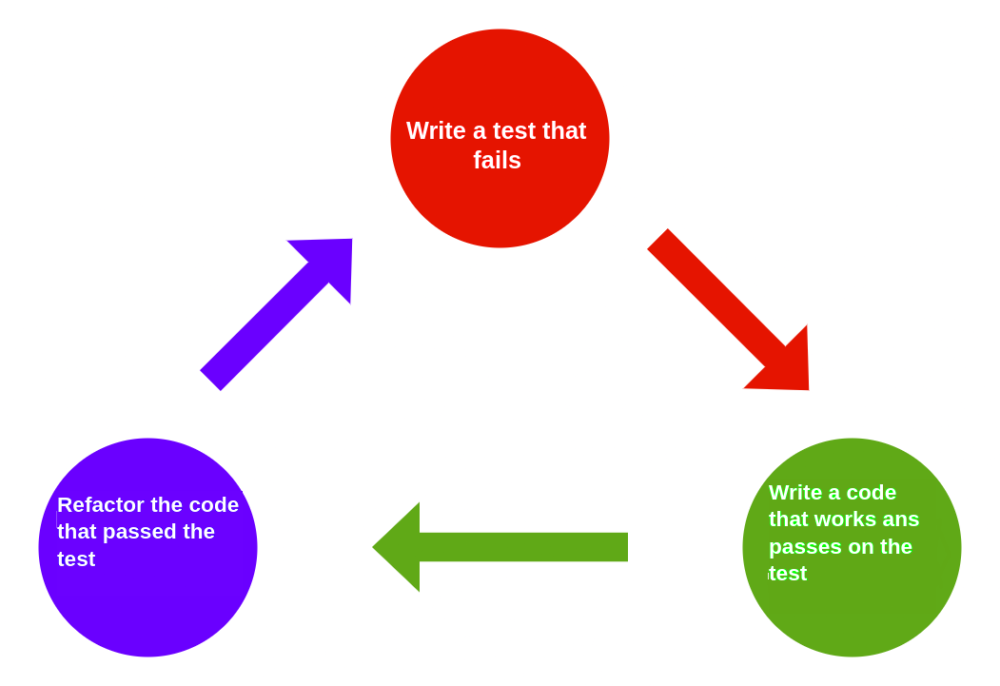

# Challenge requirements

# ATM Challange 💰

The day-to-day life of a developer is full of demands and here will be no different! It's your turn to develop an ATM system! 💰😮 But calm down... before starting, see all the criteria that the system must have to allow the client to:

- To sign in to the system;

- To visualize and manipulate their  bank account information;

- To have access to all transaction made.

⚠️**Remember:** ⚠️the company you represent follows the Test Driven Development (TDD) practice to develop their systems. Check the image below to remember how it works: 👇



First, we will develop tests, and then the classes of this ATM's system, ok?

The mandatory tests are described below (note that you are free to add more tests), following are the classes the system must have:


## 1. Tests

- `BankTest`: this class contains all the tests related to the methods of our ATM system's `Bank` class.
    - Test Methods:
        - `generateNumberNewAccountTest`: verifies if the method `generateNumberNewAccount` is returning a String 10 digits long, that represents the number of the new account opened.
        - `addPersonCustomerTest`: tests if the method `addPersonCustomer` is adding objects of type `PersonCustomer` the the `peopleCustomers` of the class `Banck`. Represents the insertion of new people customers to the bank, and returns an object of class `PersonCustomer`.
        - `personCustomerLoginTest`: verifies if the method `personCustomerLogin` grants access of people customers and denies accesses with wrong CPF and password combination.
        - `depositTestTransferFundsTestShowBalanceStatementTest`: tests if the method `deposit` is adding to the balance of the bank account the value passed as an argument argumento, and `transferFunds` is transferring amounts in cash between accounts of the same person customer.
        Both the method `deposit` and the method `transferFunds` do not return any value, hence, use the method `showBalanceStatement` to print to the console for us to verify it. With this said, it makes sense that you utilize the three in a single test method because to transfer values from one account to another one, the account that will cede the money must have a positive balance.
        - `depositTestWithdrawTestShowBalanceStatementTest`: test if the method `deposit` is adding to the balance of the bank account the value passed as an argument, and the method `withdraw` is subtracting from the balance of the bank account the correct amount passed as an argument. As the method `deposit` and the method `withdraw` do not return values, you must use the method `showBalanceStatement` to printto the console and verify it. With that, it makes sense to test the three in a single test method because to be able to withdraw values from one account, it must have a positive balance.

- `AccountTest`: this class contains tests related to the methods from the `Account` class.
    - Test Methods:
        - `constructorTest`: evaluates if the constructor is initializing the `Account` class attributes correctly.
        - `addTransactionTestReturnBalanceTest`: verifies if the method `addTransaction` is adding a transaction to the account history performed by the given method realizada, and analyses if the method `returnBalance` retunrs the account balance correctly. It makes sense to test both together, as the method `addTransaction` does not have a return, we use `returnBalanace` to verify if the transaction was correctly added to the account and if the balance is being returned without errors. 
        - `returnAccountSummaryTest`: verifiesif the method `returnAccountSummary` is presenting a summary of the bank account.
        - `returnBalanceStatementTest`: tests if the method `returnBalanceStatement` is presenting the balance statementof the bank account.
        - `getAccountIdTest`: evaluates if the method `Getter` of the attribute `accountId` is returning the identification number of the account.
        - `getPersonCustomerTest`: verifies if the method `Getter` of the attribute `personCustomer` is returning the person customer of the bank account.

- `PersonCustomerTest`: this class haas the test methods of `PersonCustomer` class.
    - Test Methods:
        - `constructorTest`: evaluates if the class's constructor is initializing its attribute correctly and printing a message to the console indicating that an object of the `PersonCustomer` class has been instantiated.
        - `adicionarContaTestRetornaNumeroDeContasTest`: verifica se o método `adicionarConta` está adicionando nova conta para pessoa cliente e também analisa se o método `retornaNumeroDeContas` retorna o número que representa a quantidade de contas que uma pessoa cliente possui. Faz sentido testar esses dois métodos juntos, pois o método `adicionarConta` não tem retorno, então usamos o método `retornarNUmeroDeContas` para verificar se a conta foi adicionada e já aproveitamos para testar o seu funcionamento. 
        - `retornarSaldoContaEspecificaTest`: testa se o método `retornarSaldoContaEspecifica` retorna o saldo de uma conta bancária específica corretamente.
        - `retornarIdContaEspecificaTest`: verifica se o método `retornarIdContaEspecifica` está retornando o número identificador de uma conta bancária específica corretamente .
        - `retornarExtratoContaEspecificaTest`: avalia se o método `retornarExtratoContaEspecifica` retorna o extrato bancário de uma conta específica da pessoa cliente.
        - `adicionarTransacaoContaEspecificaTest`: testa se o método `adicionarTransacaoContaEspecifica` está adicionando uma transação a uma conta específica da pessoa cliente,
        - `validarSenhaTest`: testa se o método `validarSenha` está verificando se a senha passada por parâmetro é a mesma que foi cadastrada ao criar a pessoa cliente.
        - `retornarResumoContasTest`: analisa se o método `retornarResumoContas` retorna o resumo das contas da pessoa cliente.
        - `getCpfTest`: avalia se o método `Getter` do atributo `cpf` da pessoa cliente está retornando o CPF cadastrado.

- `TransacaoTest`: essa classe contém todos os testes relacionados aos métodos da classe `Transacao`.
    - Métodos de Teste:
        - `construtorTest`: verifica se o método construtor está inicializando os atributos corretamente.
        - `getQuantiaTest`: testa se o método `Getter` do atributo quantia está retornando a quantia corretamente.
        - `retornarResumoTransacaoTest`: avalia se o método `retornarResumoTransacao` apresenta o resumo da transação corretamente.
        - `retornarInstanteTest`: verifica se o método `retornarInstante` retorna o momento correto em que a transação ocorreu, com data, hora, minuto e segundo.

Ufa! Quantos testes não!?  😅 

Agora vamos para as classes que o sistema de caixa eletrônico deve ter!


## 2. Classes

- `Banco`: representa a entidade banco do nosso caixa eletrônico. Essa classe é a responsável por criar novas pessoas clientes no banco e também verificar e validar o login da pessoa cliente no caixa eletrônico.
    - Atributos:
        - `pessoasClientes`: esse atributo é um array de objetos da classe `PessoaCliente` (ex: ArrayList<PessoaCliente>), e representa a lista de pessoas clientes que tem contas abertas no banco (uma pessoa cliente pode ter mais de uma conta aberta).
        - `contas`: esse atributo é um array de objetos da classe `Contas` (ex: ArrayList<Conta>) e representa a lista de contas abertas no banco, onde cada uma pertence a uma pessoa cliente. As contas são identificadas por uma String de 10 dígitos, que representa um número identificador único gerado pelo método `gerarNumeroNovaConta` da classe `Banco`.
    
    - Métodos:
        - `gerarNumeroNovaConta`: esse método é público, deve retornar uma String  e não recebe nenhum argumento. Ele é responsável por gerar e retornar uma String de 10 dígitos, que representa o número identificador único de uma conta, ou seja, para cada nova conta aberta, ele deve gerar um número único (ex: "8514540006").         
        - `adicionarPessoaCliente`: esse método é público, retorna um objeto do tipo `PessoaCliente` e deve receber 3 argumentos do tipo String (nome, cpf, e senha). Esse método deve instanciar um objeto da classe `PessoaCliente` e adicioná-lo no array `pessoasClientes`, e deve retornar esse objeto da classe `PessoaCliente` criado.
        - `adicionarConta`: esse método é público e tem o retorno do tipo `void`, ou seja, não retorna nenhum valor e recebe 1 argumento (novaConta) do tipo `Conta`. Esse método é responsável por receber uma conta como parâmetro e adicionar ao array `contas`.
        - `pessoaClienteLogin`: esse método é público, retorna um objeto do tipo `PessoaCliente` e recebe 2 argumentos do tipo String (cpf e senha). Ele é responsável por buscar no array `pessoasClientes` , o objeto que é dono do cpf passado por parâmetro e verificar se a senha está correta. Caso o cpf e a senha sejam de algum objeto que está no array `pessoasClientes`,  o objeto que representa a pessoa cliente deve ser retornado; caso contrário, esse método deve retornar `null`.
        - `transferirFundos`: esse método é público, deve ter o retorno do tipo `void` (não retorna nenhum valor) e deve receber quatro atributos, que são`pessoaCliente`, do tipo da classe `PessoaCLiente`(representando a pessoa cliente logada); `daConta`, do tipo inteiro que representa o índice no array `contas` da conta (responsável por ceder o dinheiro para a transferência); `paraConta`, do tipo inteiro que representa o índice no array `contas` (para a conta que receberá a transferência); e por fim, `quantia`, que é do tipo `double` (representa o valor que será transferido). 
        - `sacar`: esse método é público, deve ter o retorno do tipo `void` (não retorna nenhum valor) e deve receber três atributos, que são `pessoaCliente`, do tipo da classe `PessoaCLiente` (representando a pessoa cliente logada); `daConta`, do tipo inteiro (representando o índice no array `contas` da conta na qual será sacado o dinheiro); e por fim, `quantia`, que é do tipo `double` (representa o valor que será sacado).
        - `depositar`: esse método é público, deve ter o retorno do tipo `void` (não retorna nenhum valor) e deve receber três atributos, que são `pessoaCliente`, do tipo da classe `PessoaCLiente` (representa a pessoa cliente logada); `paraConta`, do tipo inteiro (representa o índice no array `contas` da conta na qual será depositado o dinheiro); e por fim, `quantia`, que é do tipo `double` (representa o valor que será depositado).
        - `mostrarExtrato`: esse método também é público, deve ter o retorno do `void`, e deve receber dois atributos, que são pessoaCliente, do tipo da classe `PessoaCliente` (que representa a pessoa cliente dona da conta) e o `conta`, que é do tipo inteiro (representa o índice da conta que será mostrada o extrato no array `contas`).

**Olha a dica:** 👀 no método `gerarNumeroNovaConta`, utilize o método `nextInt`, da classe `Random` do pacote `java.util`, para gerar os dígitos. Gere um dígito de cada vez e concatene em uma String. Ao final, verifique se algum objeto conta já criado tem esse mesmo número identificador. Caso tenha, realize o processo novamente até ser gerado um identificador único. E no método `transferirFundos` considere que uma pessoa cliente só pode transferir dinheiro entre as suas próprias contas, uma conta corrente e uma conta poupança. 

- `Conta`: representa as contas do banco, onde temos os métodos relacionados às transações, e mostra as informações de saldo.
    - Atributos:
        - `tipoConta`: atributo do tipo String que indica se a conta é "Poupança" ou "Corrente".
        - `idConta`: atributo do tipo String que representa o número de identificação único da conta bancária.
        - `pessoaCliente`: atributo do tipo `PessoaCliente`, que representa a pessoa cliente dona da conta em questão.
        - `transacoes`: esse atributo é um array de objetos da classe `Transacao` (ex: ArrayList<Transacao>), responsável por armazenar todas as transações realizadas na conta.

    - Métodos:
        - Construtor: esse método construtor deve receber como argumentos `tipoConta` do tipo String; `pessoaCliente` do tipo da classe `PessoaCliente`; e `banco` do tipo da classe `Banco`. Ele deve utilizar esses argumentos para inicializar os respectivos atributos e utilizar o método `gerarNumeroNovaConta` para gerar o número de identificador único para a conta.
        - `adicionarTransacao`: esse método é público e de retorno do tipo `void`. Deve receber dois argumentos, que são `quantia` do tipo `double` e a `descricao` do tipo String. `quantia` indica o valor que envolve a transação e `descricao` indica que tipo de transação foi realizada (ex: Depósito recebido, Saque efetuado, etc.). Deve-se usar esses valores para instanciar um objeto da classe `Transacao`, passando a quantia e a descrição (ex: `Transacao novaTransacao = new Transacao(quantia, "Transferência recebida");`) e adicionando esse novo objeto no array `transacoes`.
        - `retornarSaldo`: esse método é público e retorna o tipo `double`. Ele usa o array `transacoes` para calcular o saldo da conta em questão. 
        - `retornarResumoConta`: é do tipo público e retorna um String com o resumo da conta, número de identificação único, saldo e tipo da conta (Poupança ou Corrente). Ele usa o método `retornarSaldo` para calcular o saldo da conta.
        - `retornarExtrato`: esse método é público e tem retorno do tipo `void`. Esse método imprime no console todas as transações (uma por linha) da conta. Em outras palavras, esse método percorre o array `transacoes` e para cada objeto desse array, chama o método `retornarResumoTransacao` da classe `Transacao`.
        - `getIdConta`: método `Getter` do atributo `idConta`.
        - `getPessoaCliente`: método `Getter` do atributo `pessoaCliente`.
        
⚠**Atenção⚠:** perceba que a soma das transações indica o saldo da conta, onde saques e transferências enviadas são valores negativos e os depósitos e transferências recebidos são valores positivos nessa soma.

- `PessoaCliente`: essa classe representa as pessoas clientes do banco.
    - Atributos:
        - `nomeCompleto`: atributo do tipo String para armazenar o nome da pessoa cliente.
        - `cpf`: atributo do tipo String para armazenar o CPF da pessoa cliente.
        - `senha`: atributo do tipo String para armazenar a senha da pessoa cliente.
        - `contas`: esse atributo é um array de objetos da classe `Conta` (ex: ArrayList<Conta>), responsável por armazenar todas as contas que a pessoa cliente possui.

    - Métodos:
        - Construtor: inicializa os atributos da classe `PessoaCliente` e recebe três atributos do tipo String, que são `nome`, `cpf`` e `senha`. Esses argumentos são utilizados para inicializar os respectivos atributos. Por fim, esse método construtor imprime uma mensagem no console indicando que a pessoa cliente foi criada (ex: "Nova pessoa cliente Alexiania Silva com CPF: 433.892.200-11 criada!")
        - `adicionarConta`: esse método é público e deve ter o retorno do tipo `void`. Ele recebe um argumento `conta`, do tipo da classe `Conta`, e adiciona ele no array `contas`.
        - `retornaNumeroDeContas`: método público que retorna um inteiro (não recebe nenhum argumento). O inteiro que é retornado por esse método é a quantidade de objetos no array `contas`, ou seja, o seu tamanho.
        - `retornarSaldoContaEspecifica`: esse método é público e retorna um valor do tipo `double`, recebendo como argumento um `indice` do tipo inteiro (para ser usado como índice no array `contas`) e usando o método `retornarSaldo` da classe `Conta` para retornar o saldo.
        - `retornarIdContaEspecifica`: esse método é público e retorna um valor do tipo String, recebendo um argumento `indice` do tipo inteiro (para ser usado como índice no array `contas`) e usando o método `getIdConta` da classe `Conta` para retornar o número identificador único da conta.
        - `retornarExtratoContaEspecifica`: esse método é público e tem um retorno do tipo `void`, recebendo um argumento `indice` do tipo inteiro (para ser usado como índice no array `contas`) e usando o método `retornarExtrato` da classe `Conta` para imprimir todas as transações de uma determinada conta.
        - `adicionarTransacaoContaEspecifica`: esse método público e tem retorno do tipo `void`, recebendo 3 argumentos, que são `indice` do tipo inteiro, `quantia` do tipo `double` e `descricao` do tipo String. Esse método utiliza o argumento `indice` para selecionar uma conta específica dentro do array `contas` e chama o método `adicionarTransacao` da classe `Conta` para adicionar uma transação e passar os argumentos `quantia` e `descricao`.
        - `validarSenha`: esse método é público e retorna um valor `boolean`, recebendo um argumento `senha` do tipo String e verificando se essa String é igual ao atributo `senha` do objeto. Se for, retorna `true`, se não for retorna `false`.
        - `retornarResumoContas`: esse método é público e tem retorno do tipo `void`. Ele não recebe argumento e percorre o array `contas`, utilizando o método `retornarResumoConta` da classe `Conta` para imprimir o resumo da conta.
        - `getCpf`: método `Getter` do atributo `cpf`.

- `Transacao`: essa classe é utilizada para representar a transação nas contas do banco.
    - Atributos:
        - `quantia`: esse atributo é do tipo `double` e representa o valor da transação.
        - `instante`: esse atributo é do tipo String e armazena a data e a hora que a transação ocorreu.
        - `descricao`: esse atributo é do tipo String e armazena a descrição da transação.
        - `conta`: esse atributo é do tipo `Conta` e armazena o objeto `conta` da transação.
    
    - Métodos:
        - Construtor: esse método recebe dois argumentos, que são `quantia` do tipo `double` e `descricao` do tipo String. Ele usa esses argumentos para inicializar seus respectivos atributos e chama o método `retornarInstante` para armazenar a data e a hora que essa transação foi realizada.
        - `getQuantia`: método `Getter` do atributo `quantia`.
        - `retornarResumoTransacao`: esse método é público e retorna uma String que representa o resumo da transação, contendo as informações instante, quantia e descrição. Ele não recebe nenhum argumento.
        - `retornarInstante`: esse método é público e retorna um String que representa o instante em que esse método é invocado. Ele usa a classe `LocalDateTime` para recuperar o momento em que o método é invocado (`LocalDateTime.now()`) e a classe `DateTimeFormatter` para formatar para o padrão brasileiro (ex: 20/01/2022 10:24:30). Esse método é usado no método construtor para inicializar o atributo `instante`.


Para ajudar, implemente agora a classe `CaixaEletronico`, que contém o método `main`. Dessa forma, você terá um ponto de partida. Agora siga o passo a passo abaixo: 👇

1. Primeiro importe a classe `Scanner`, e então escreva o método `main`. Aqui você deve instanciar um objeto da classe `Banco` e usá-la para criar três pessoas clientes e duas contas para cada pessoa cliente.

⚠**Atenção⚠:** Após a criação das pessoas clientes e suas respectivas contas bancárias, você vai entrar em um laço infinito que é o sistema do caixa eletrônico em si. A princípio ele mostra uma mensagem de boas-vindas e permite que a pessoa cliente possa entrar com seus dados para poder acessar sua conta. Se a pessoa cliente entrar com os dados incorretos, o fluxo do programa vai entrar na primeira condição (`if`) e reapresentará a mensagem de boas-vindas e os campos para que a pessoa cliente possa tentar novamente. Quando a pessoa cliente entra com os dados corretos,  o fluxo do sistema entra na segunda condição (`else`) e é apresentado um menu para manipulação das suas contas bancárias.


2. Na segunda etapa você verá um resumo das contas bancárias da pessoa usuária e também um menu com cinco opções (quatro delas para manipular a sua conta bancária e a quinta para fazer o logout do sistema e voltar para a tela de boas-vindas com os campos para fazer o login). 

👀Observe que cada opção é uma condição `if`/`else`! Dentro delas fazemos os tratamentos de dados inseridos de forma errada, com mensagens que indiquem o que foi que a pessoa cliente errou. Já quando os dados são inseridos corretamente, chamamos os respectivos métodos do banco para realizar a operação relativa à opção selecionada.

```java
package com.trybe.caixaeletronico;

import java.util.Scanner;

public class CaixaEletronico {

  public static void main(String[] args) {

	  Scanner sc = new Scanner(System.in);
	
    Banco banco = new Banco();
    
    /* adiciona algumas pessoas clientes ao banco criando ja uma conta poupanca 
     * e em seguida adiciona uma conta corrente para essas pessoas
     */
    
    // pessoa cliente 1
    PessoaCliente pessoaCliente1 = banco.adicionarPessoaCliente("Alexiania Pereira", "842.074.410-77", "1234"); 
    banco.adicionarConta("Poupança", pessoaCliente1);
    banco.adicionarConta("Corrente", pessoaCliente1);
    
    // pessoa cliente 2
    PessoaCliente pessoaCliente2 = banco.adicionarPessoaCliente("Abadiania Silva", "848.725.510-87", "1234");
    banco.adicionarConta("Poupança", pessoaCliente2);
    banco.adicionarConta("Corrente", pessoaCliente2);

    // pessoa cliente 3
    PessoaCliente pessoaCliente3 = banco.adicionarPessoaCliente("Camaragibe Oliveira", "433.892.200-11", "1234");
    banco.adicionarConta("Poupança", pessoaCliente3);
    banco.adicionarConta("Corrente", pessoaCliente3);
    // laco infinito
    while (true) {
      
      System.out.println("\n\nBem-vindo ao Banco da Trybe\n\n");
      System.out.print("Entre com seu CPF: ");
      String pessoaClienteCpf = sc.nextLine();
      System.out.print("Entre com sua senha: ");
      String senha = sc.nextLine();

      PessoaCliente pessoaClienteAutenticada = banco.pessoaClienteLogin(pessoaClienteCpf, senha);
      
      if (pessoaClienteAutenticada == null) {
        System.out.println("Combinação de CPF e senha incorretos. Tente novamente");

      } else {

        int op;

        // menu para manipulacao das contas da pessoa cliente
        do {
          
          // mostra o resumo das contas da pessoa cliente
      	  pessoaClienteAutenticada.retornarResumoContas();

          System.out.println("O que você gostaria de fazer?");
          System.out.println("  1) Mostrar Extrato");
          System.out.println("  2) Sacar");
          System.out.println("  3) Depositar");
          System.out.println("  4) Transferir");
          System.out.println("  5) Sair");
          System.out.println();
          System.out.print("Entre com sua opção: ");

          op = sc.nextInt();

          if (op < 1 || op > 5) {
            System.out.println("Opção inválida, escolha uma opção válida.");
          }
          
          // processando a escolha
          if (op == 1) {
            
            int conta;

            // pega o indice da conta para imprimir o extrato
            do {
              System.out.printf("Entre com o número (1-%d) para a conta\nque "
                                       + "o extrato será impresso: ", pessoaClienteAutenticada.retornaNumeroDeContas());
              conta = sc.nextInt() - 1;
              if (conta < 0 || conta >= pessoaClienteAutenticada.retornaNumeroDeContas()) {
                System.out.println("Número inválido, tente novamente.");
              }else {
            	break;
              }
            } while (true);
        	
        	 banco.mostrarExtrato(pessoaClienteAutenticada, conta);
            
            
            
            
          } else if (op == 2) {
        	
        	int deConta;
            double quantia;
            double saldoConta;

            // pega o indice da conta para saque
            do {
              System.out.printf("Entre o número (1-%d) para selecionar a conta para "
                                   + "o saque: ", pessoaClienteAutenticada.retornaNumeroDeContas());
              deConta = sc.nextInt() - 1;
              if (deConta < 0 || deConta >= pessoaClienteAutenticada.retornaNumeroDeContas()) {
                System.out.println("Índice de conta inválido, tente novamente.");
              } else {
            	break;
              }
            } while (true);
            
            // retorna o saldo da conta selecionada para ver se tem fundos suficientes
            saldoConta = pessoaClienteAutenticada.retornarSaldoContaEspecifica(deConta);

            // pega a quantia para o saque
            do {
              System.out.printf("Entre com a quantia a ser sacada (máximo R$%.02f): R$ ", saldoConta);
              quantia = sc.nextDouble();
              if (quantia < 0) {
                System.out.println("quantia deve ser maior que zero.");
              } else if (quantia > saldoConta) {
                System.out.printf("quantia não pode ser maior que o saldo "
                                        + "de R$ %.02f.\n", saldoConta);
              } else {
            	break;
              }
            } while (true);

        	banco.sacar(pessoaClienteAutenticada, deConta, quantia);
            
          } else if (op == 3) {
        	
        	int paraConta;
            double quantia;

            // pega o indice da conta para deposito
            do {
              System.out.printf("Entre com o número (1-%d) para selecionar a conta para "
                                     + "depósito: ", pessoaClienteAutenticada.retornaNumeroDeContas());
              paraConta = sc.nextInt() - 1;
              
              if (paraConta < 0 || paraConta >= pessoaClienteAutenticada.retornaNumeroDeContas()) {
                System.out.println("Índice de conta inválido, tente novamente.");
              
              } else {
            	break;
              }
            } while (true);

            // pega quantia para depositar
            do {
              System.out.printf("Entre com a quantia de depósito: R$ ");
              quantia = sc.nextDouble();
              
              if (quantia < 0) {
                System.out.println("quantia deve ser maior que zero.");
              
              } else {
            	break;
              }
            } while (true);

        	// realiza o deposito
            banco.depositar(pessoaClienteAutenticada, paraConta, quantia);
            
          } else if (op == 4) {
        	
        	int daConta;
        	int paraConta;
        	double quantia;
        	double saldoConta;
        	
            // pega o indice de uma conta retirar o valor da transferencia
            do {
              System.out.printf("Entre o número (1-%d) para "
            	                      + "retirar o valor para transferência: ", pessoaClienteAutenticada.retornaNumeroDeContas());
              daConta = sc.nextInt() - 1;
              if (daConta < 0 || daConta >= pessoaClienteAutenticada.retornaNumeroDeContas()) {
                System.out.println("Índice de conta inválido, tente novamente.");
              } else {
            	break;
              }
            } while (true);

            // retorna o saldo da conta selecionada para ver se tem fundos suficientes
            saldoConta = pessoaClienteAutenticada.retornarSaldoContaEspecifica(daConta);

            // pega o indice da conta que vai receber o valor da transferencia
            do {
              System.out.printf("Entre o número (1-%d) para "
                                     + "selecionar a conta que receberá a transferência: ", pessoaClienteAutenticada.retornaNumeroDeContas());
              paraConta = sc.nextInt() - 1;
              if (paraConta < 0 || paraConta >= pessoaClienteAutenticada.retornaNumeroDeContas()) {
                System.out.println("Índice de conta inválido, tente novamente.");
              } else {
            	break;
              }
            } while (true);

            // pega o valor para transferir
            do {
              /* pega a quantia para ser transferida de uma conta da pessoa cliente para outra
               * levando em consideracao o saldo da conta que cedera o dinheiro
               */
              System.out.printf("Entre com a quantia para ser transferida (máximo R$%.02f): R$ ", saldoConta);
              quantia = sc.nextDouble();
              
              if (quantia < 0) {
                System.out.println("quantia deve ser maior que zero.");
              
              } else if (quantia > saldoConta) {
                System.out.printf("quantia não pode ser maior que o valor do saldo "
                                       + "de R$.02f.\n", saldoConta);
              } else {
            	break;
              }
            } while (true);
            
            // envia as informacoes para o banco realizar a trasnferencia
            banco.transferirFundos(pessoaClienteAutenticada, daConta, paraConta, quantia);
            
          } else if (op == 5) {
        	System.out.println("Logout realizado com sucesso!");
            break;
          }

        } while (true);    	
    	
      }// fim else
      
      
    }// fim loop infinito
  } 
}
```
⚠**Atenção⚠:** essa classe `CaixaEletronico` é a principal do nosso sistema, pois ela contém o método `main` e como podemos ver na implementação, ele é o responsável por toda a interação com a pessoa cliente. Em outras palavras, essa classe é a interface entre a pessoa cliente e nosso sistema do banco. Com ela e as informações descritas anteriormente sobre as classes e seus métodos, você conseguirá entregar essa demanda com sucesso! 🚀 

#VQV

## Exemplo

Considerando que tenha executado exatamente o código da classe `main` acima e interagido como se fôssemos a pessoa cliente Camaragibe Oliveira, teríamos a seguinte interação com o console:
```
Nova pessoa cliente Alexiania Pereira com CPF: 842.074.410-77 criada!

Nova pessoa cliente Abadiania Silva com CPF: 848.725.510-87 criada!

Nova pessoa cliente Camaragibe Oliveira com CPF: 433.892.200-11 criada!


Bem-vindo ao Banco da Trybe


Entre com seu CPF: 433.892.200-11
Entre com sua senha: 1234


Resumo das Contas da pessoa Camaragibe Oliveira:

1) 1376245820 : R$0.00 : Poupança

2) 1400842111 : R$0.00 : Corrente


O que você gostaria de fazer?
  1) Mostrar Extrato
  2) Sacar
  3) Depositar
  4) Transferir
  5) Sair

Entre com sua opção: 3
Entre com o número (1-2) para selecionar a conta para depósito: 1
Entre com a quantia de depósito: R$ 2000


Resumo das Contas da pessoa Camaragibe Oliveira:

1) 1376245820 : R$2000.00 : Poupança

2) 1400842111 : R$0.00 : Corrente


O que você gostaria de fazer?
  1) Mostrar Extrato
  2) Sacar
  3) Depositar
  4) Transferir
  5) Sair

Entre com sua opção: 3
Entre com o número (1-2) para selecionar a conta para depósito: 2
Entre com a quantia de depósito: R$ 4000


Resumo das Contas da pessoa Camaragibe Oliveira:

1) 1376245820 : R$2000.00 : Poupança

2) 1400842111 : R$4000.00 : Corrente


O que você gostaria de fazer?
  1) Mostrar Extrato
  2) Sacar
  3) Depositar
  4) Transferir
  5) Sair

Entre com sua opção: 4
Entre o número (1-2) para retirar o valor para transferência: 2
Entre o número (1-2) para selecionar a conta que receberá a transferência: 1
Entre com a quantia para ser transferida (máximo R$4000.00): R$ 2000


Resumo das Contas da pessoa Camaragibe Oliveira:

1) 1376245820 : R$4000.00 : Poupança

2) 1400842111 : R$2000.00 : Corrente


O que você gostaria de fazer?
  1) Mostrar Extrato
  2) Sacar
  3) Depositar
  4) Transferir
  5) Sair

Entre com sua opção: 1
Entre com o número (1-2) para a conta
que o extrato será impresso: 1

Extrato da conta 1376245820

21/01/2022 14:21:52 -------- Transferência recebida: R$ 2000.00 +
21/01/2022 14:21:32 -------- Depósito recebido: R$ 2000.00 +


Resumo das Contas da pessoa Camaragibe Oliveira:

1) 1376245820 : R$4000.00 : Poupança

2) 1400842111 : R$2000.00 : Corrente


O que você gostaria de fazer?
  1) Mostrar Extrato
  2) Sacar
  3) Depositar
  4) Transferir
  5) Sair

Entre com sua opção: 
```

Muito legal né? Bom trabalho! 🚀 #VQV
---